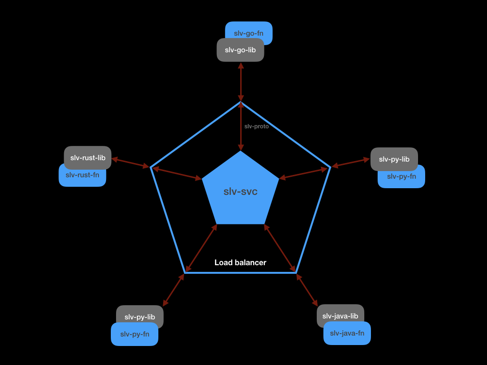

# slv-proto

### Goals
- Provide a secure, authenticated transport for SLV libraries to use.

### Overview

This repository contains the proto files used by Serverless Ledger Variables (SLV) libraries to relay the user instructions to perform operations to Slv-Svc.

The user does not need to use these proto files but use the slv-go-lib (or equivalent) repository.

### Overview of Serverless Ledger Variables (SLV)

SLV provides a way for serverless functions to create and manage state. In addition to usual properties such Type, Scope, Permissions; SLV provides -

- All writes to the state are performed when the Blockchain consensus is achieved.
- History of all changes to the state can be queried.

